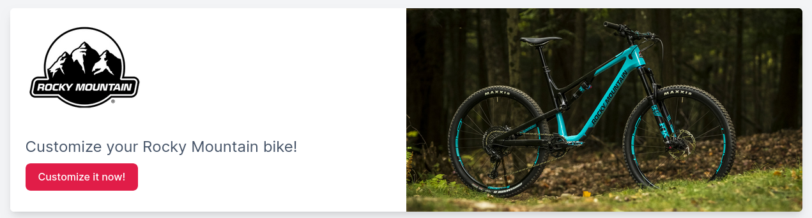
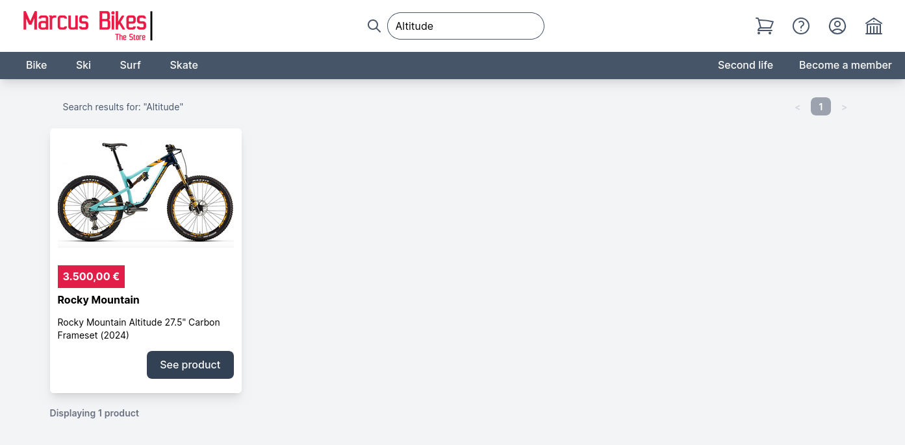
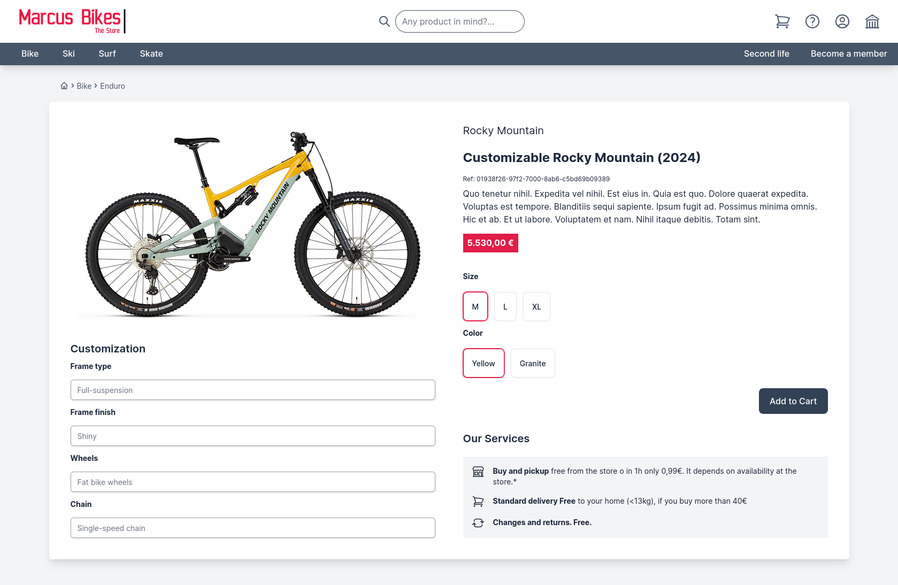
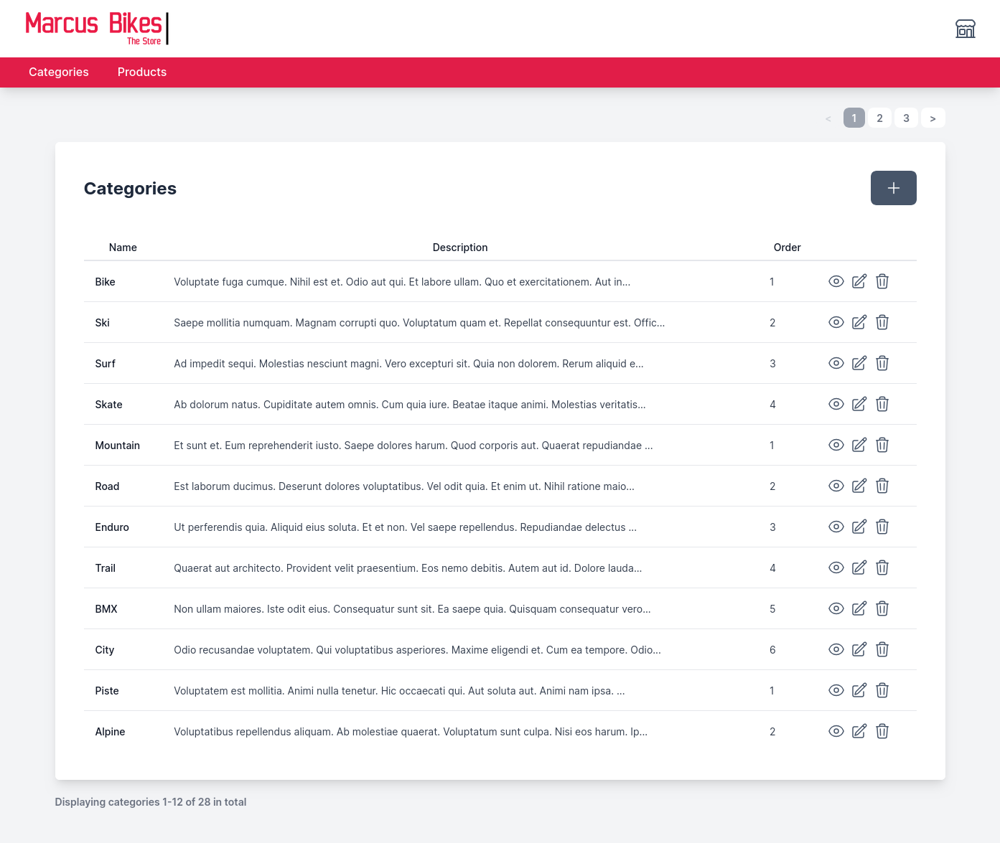
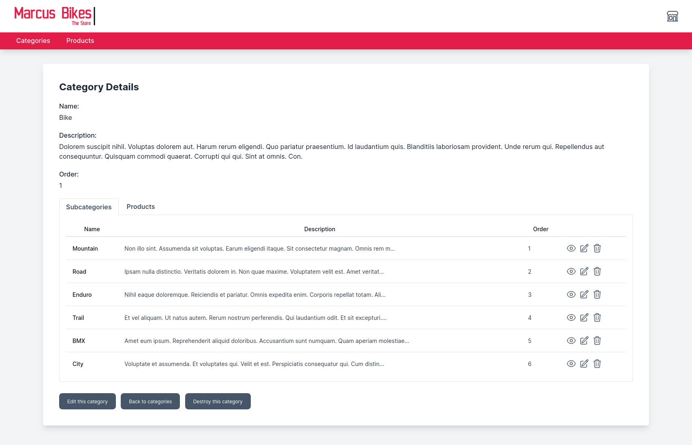
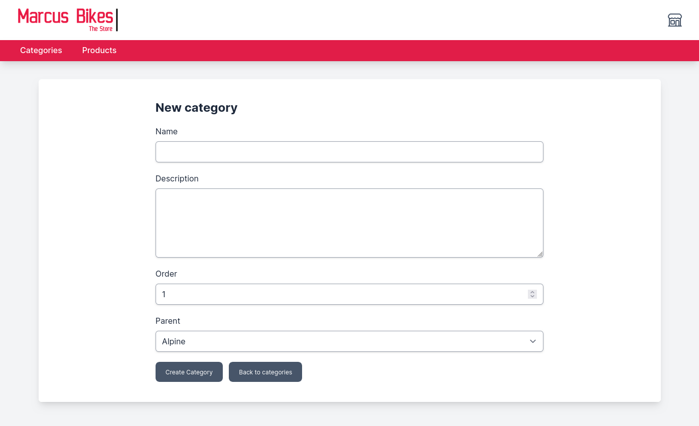

# Marcu's Bikes, the e-commerce exercise <!-- omit from toc -->

Welcome to Marcus's Bikes online shop, I'm [Moisés Déniz Alemán](https://www.linkedin.com/in/moises-deniz/) and this is the coding exercise for [Factorial](https://factorialhr.com/)'s Senior Backend position.

Here you have an index of the sections of this README document:

- [Instructions](#instructions)
  - [Setup](#setup)
  - [Tests](#tests)
- [Specifications](#specifications)
  - [Requirements](#requirements)
  - [Questions about the requirements](#questions-about-the-requirements)
  - [Assumptions](#assumptions)
- [Solution](#solution)
  - [Stack](#stack)
  - [Data model](#data-model)
    - [Product Catalog domain](#product-catalog-domain)
    - [Cart domain](#cart-domain)
    - [Trade-offs](#trade-offs)
  - [The shop: main pages and actions](#the-shop-main-pages-and-actions)
    - [The homepage](#the-homepage)
    - [The catalog](#the-catalog)
    - [Search for products](#search-for-products)
    - [See a product](#see-a-product)
    - [Add a product to the cart](#add-a-product-to-the-cart)
    - [Cart page](#cart-page)
    - [Adjust quantity on cart item](#adjust-quantity-on-cart-item)
    - [Remove cart item](#remove-cart-item)
  - [Administrative workflows](#administrative-workflows)
    - [Categories](#categories)
    - [Products](#products)
    - [New product creation](#new-product-creation)
    - [Adding a new part choice](#adding-a-new-part-choice)
    - [Setting prices](#setting-prices)
- [Improvements](#improvements)

## Instructions

### Setup

As this project is based on the [Ruby on Rails](https://rubyonrails.org/) framework, here you can find the steps in order to make it work.

You most probably have all the needed libraries set in your system if you have worked with Ruby on Rails lately. Here is a list of the base you need to have:

* [Ruby](https://www.ruby-lang.org) language is installed, 3.3.4
* [Ruby on Rails](https://rubyonrails.org/) framework CLI is installed, version 7.2.2
* [Bundler](https://bundler.io/) is installed, at least version 2.5
* [RubyGems](https://rubygems.org/) is installed, at least version 3.5
* You cloned the private repository and entered in a shell console inside it

Get all the gem dependencies needed by running bundler like this:

```bash
./bin/bundle install
```

Create the database and seed it up with some products with:

```bash
./bin/rails db:setup db:seed
```

To check that the app is working you can boot the webserver like this:

```bash
./bin/dev 
```
You should see an output similar to this:


And then browse to the listening url (by default is http://127.0.0.1:3000/). If you see something like this the app is successfully setup:


### Tests

The project uses [RSpec](https://rspec.info/) as testing framework. You can run the specs suite like this:

```bash
./bin/rails spec
```

Format for the output is set to [documentation](https://rspec.info/features/3-13/rspec-core/command-line/format-option/) by default in the project which prints more verbose sentences. 

Running the specs should output something similar to this:


## Specifications

Given the specifications sent to me via email (see the [PDF](doc/code_challenge_specifications.pdf) version) we can extract the requirements for this project, ask ourserlves questions, answer them and make some assumptions in order to create the proper solution.

### Requirements

After carefuly reading the specifications provided I wrote down a list of requirements the app needs to fulfill:

1. The shop's catalog not only have bikes on it. Many other types of **products** can be sold. Eg: surfboards, skis, roller skates.
2. Products can be customized. Each product can have several **customizable parts** and **customizable attributes**. Eg: a bike can have frame type, frame finish, wheels and chain as customizable parts, also size and rim color as customizable attributes.
3. Customers have to choose the final parts and attributes for their customization. For each customizable part the customer needs to choose from the available **part options** and for each customizable attribute from the available **attribute options**.
4. Any part selected can avoid other parts to be selected too, no matter if they belong to different customizable parts. So, some **banned combinations** of parts exist. Attributes belongs to each product, that way we will only represent the "good combinations".
5. Parts and attribute options can be marked as "temporarily out of stock" to avoid receiving orders of products with those parts or attributes on it.
6. Price of products are either standalone or calculated based on their parts and attributes if they are customized.
7. The price of parts can be different if they are combined with other parts in a product customization. So, the **price changes** can exist depending on other parts if they are selected. Also the attributes may imply price changes.

### Questions about the requirements

With the specifications and the requirements more clear some questions may appear. Here is a list with their answers: 

1. *Are parts also products we can sell in isolation in the shop?* They could be, but we may not want to sell certain parts in isolation.
2. *All the products must be customizable?* No, certain products can be sold as they are provided.
3. *All the customizable parts are the same for all the products?* No, each product could have different customizable parts. Eg: "Customizable Bike" can have: frame type, frame finish, wheels and chain. Whereas "Ski set" can have: ski, bindings and poles.
4. *All the customizable attributes are the same for all the products?* No, each product could have different customizable attributes. Eg: "Bike 1" can have "size" and "color". Whereas "Skiset 1" can have just "color".
5. *Can a part's price depend on more than one part that are selected too?* Yes, it may happen that a price changes for many other parts selected. Eg: frame color depends on frame type and frame finish. 

### Assumptions

Given the questions and the answers, we can assume certain things that will shape even more our solution later:

1. A part is a product too. But we may not want to sell some in isolation, we need to mark them to be part of the catalog somehow.
2. Not all the products have to be customizable. We need to mark the products as customizable.
3. In order to simplify this exercise, no customizable product can be a part option for another customizable product as this would require a hierarchy of customization that would make the UI much more complex.
4. Customizable parts can differ from one product to another. This means that the possible options for the parts have to be provided while setting up each product.
5. Customizable attributes can differ from one product to another. This means that the possible options for the attributes have to be provided while setting up each product.
6. In order to permit multiple price changes we need to store those changes as increments for the base price. That way we can sum all the changes for the combinations of parts and attributes.

## Solution

### Stack

The first choice I made was to select [Ruby](https://www.ruby-lang.org) language and leverage of the [Ruby on Rails](https://rubyonrails.org/) framework as I have more experience with to build this project.

As this is only a coding exercise I decided to use [SQLite](https://www.sqlite.org) as SQL database. In a more real example I would choose PostgreSQL.

This code repository is [git](https://git-scm.com/) based and you can find it in [github.com/mdeniz/marcus_bikes](https://github.com/mdeniz/marcus_bikes).

More concrete, I used [RSpec](https://rspec.info/) as testing framework, [TailwindCSS](https://tailwindcss.com/) as CSS styles framework and Hotwire for the interactivity (using [Turbo Frames, Turbo Streams](https://turbo.hotwired.dev) and [StimulusJS](https://stimulus.hotwired.dev/) for javascript interactions.

### Data model

We can identify two main domains for this project, the **Product Catalog** domain and the **Shopping Cart** domain. Here you can see an overall view of the ER diagram for the database:


#### Product Catalog domain

This domain comprises all the concepts related to the definition of the catalog. Categories, products and their customization are the main entities we can find here.

The core entities of this domain are **Category** and **Product**:


Here you have a specification of those entities:

* **Category**

  A category is a way of grouping products. Categories are part of a tree-like structure that help clustering the products. Eg. "Bikes" or "Mountain bikes" can be a category and "Mountain bikes" can be a children of the "Bikes" category.

  *Table definition* ([source code](db/migrate/20241126103347_create_categories.rb)):

  ```ruby
  create_table :categories do |t|
    # Name of the category
    t.string :name

    # Short description of the category
    t.string :description

    # Order among sibling categories
    t.integer :order, default: 1

    # Reference to the parent Category
    t.belongs_to :parent, null: true, foreign_key: { to_table: 'categories' }
    
    # created_at and updated_at fields
    t.timestamps
  end
  ```

  *Relationships* ([source code](app/models/category.rb)):

  ```ruby
  # The parent category
  belongs_to :category, class_name: "Category", foreign_key: :parent_id, required: fals 

  # Products in this category
  has_many :products
  ```

* **Product** (app/models/product)

  The main entity for this project. Products are the object of our sells in our store. A product can be in one category only. Eg. "Altitude 27.5\" Carbon Frameset" can be a product model of the brand "Rocky Mountain" and it could belong to the "Mountain bikes" category.

  *Table definition* ([source code](db/migrate/20241126100910_create_products.rb)):

  ```ruby
  create_table :products do |t|
    # Unique identifier for external use
    t.string :uuid, index: { unique: true, name: "unique_uuid_on_products" }

    # Brand that builds the product
    t.string :brand 

    # Name of the model
    t.string :model 

    # Short description of the product
    t.string :description

    # Amount in euros
    t.decimal :base_price, precision: 10, scale: 2

    # Picture of the product
    t.string :image

    # Year of creation
    t.integer :year

    # Is this product in the catalog? disabled product aren't visible on the catalog's UI
    t.boolean :enabled, default: false 

    # To temporarily disable the product
    t.boolean :stock_available, default: false 

    # This product can be customized?
    t.boolean :customizable, default:false

    # Reference to the Category this product belongs to 
    t.references :category, null: false, foreign_key: true

    # created_at and updated_at fields
    t.timestamps
  end
  ```
  *Relationships* ([source code](app/models/product.rb)):

  ```ruby
   # Custom attributes
  has_many :customizable_attributes, dependent: :destroy
  has_many :attribute_options, through: :customizable_attributes

  # Custom parts
  has_many :customizable_parts, dependent: :destroy
  has_many :part_options, through: :customizable_parts
  has_many :selectable_products, class_name: "Product", through: :customizable_parts, source: :products

  # Banned combinations (a product can be in the source or in the target of a banned combination)
  has_many :banned_combinations_as_source, class_name: "BannedCombination", foreign_key: :source_id
  has_many :banned_combinations_as_target, class_name: "BannedCombination", foreign_key: :target_id
  has_many :incompatible_products_as_source, class_name: "Product", through: :banned_combinations_as_source, source: :target
  has_many :incompatible_products_as_target, class_name: "Product", through: :banned_combinations_as_target, source: :source

  # Price changes
  has_many :price_changes, foreign_key: :changed_product_id
  ```

--- 

The entities in charge of representing the customization are **Customizable Part**, **Customizable Attribute**, **Part Option** and **Attribute Option**


Here you have a specification of those entities:

* **Customizable Attribute**

  A customizable attribute is the definition of the attribute that the customer will select options from. Eg: "Size" can be a customizable attribute.

  *Table definition* ([source code](db/migrate/20241130095940_create_customizable_attributes.rb)):

  ```ruby
  create_table :customizable_attributes do |t|
    # Name of the customizable attribute
    t.string :name

    # Short description of the customizable attribute
    t.string :description

    # Order among sibling customizable attributes
    t.integer :order, default: 1

    # Reference to the product it belongs to
    t.belongs_to :product, null: false, foreign_key: true
    
    # created_at and updated_at fields
    t.timestamps
  end
  ```

  *Relationships* ([source code](app/models/customizable_attribute.rb)):

  ```ruby
  belongs_to :product
  
  # Attribute options for this customizable attribute
  has_many :attribute_options, dependent: :destroy
  ```

* **Attribute Option**

  An attribute option is one of the options available to choose from in a customizable attribute. Eg. If "Size" is a customizable attribute, then "S", "M", "L", "XL" can be attribute options.

  *Table definition* ([source code](db/migrate/20241130100051_create_attribute_options.rb)):

  ```ruby
  create_table :attribute_options do |t|
    # Name of the attribute option
    t.string :name

    # Short description of the attribute option
    t.string :description

    # Order among sibling attribute options
    t.integer :order, default: 1
    
    # Price change this attribute option adds to the base price of the product if selected
    t.decimal :price_change, precision: 10, scale: 2, default: 0

    # Is there any available in the stock?
    t.boolean :stock_available, default: false

    # Reference to the customizable attribute it belongs to
    t.belongs_to :customizable_attribute, null: false, foreign_key: true
    
    # created_at and updated_at fields
    t.timestamps
  end
  ```

  *Relationships* ([source code](app/models/attribute_option.rb)):

  ```ruby
  # The customizable attribute it belongs to
  belongs_to :customizable_attribute
  ```

* **Customizable Part**

  A customizable part is the definition of the part that the customer will select options from. Eg: "Frame type" can be a customizable part.

  *Table definition* ([source code](db/migrate/20241126163737_create_customizable_parts.rb)):

  ```ruby
  create_table :customizable_parts do |t|
    # Name of the customizable part
    t.string :name

    # Short description of the customizable part
    t.string :description

    # Order among sibling customizable parts
    t.integer :order, default: 1

    # Reference to the product it belongs to
    t.belongs_to :product, null: false, foreign_key: true
    
    # created_at and updated_at fields
    t.timestamps
  end
  ```

  *Relationships* ([source code](app/models/customizable_part.rb)):

  ```ruby
  # The product this customizable part belongs to
  belongs_to :product
  
  # Part options for this customizable part
  has_many :part_options, dependent: :destroy

  # The actual products that are options through the part options
  has_many :products, through: :part_options
  ```

* **Part Option**

  A part option represents one of the options available to choose from in a customizable part, it points to a product. Eg. If "Frame type" is a customizable part, then a part option could point to the products "Full-suspension", "Diamon", "Step through".

  *Table definition* ([source code](db/migrate/20241126172237_create_part_options.rb)):

  ```ruby
  create_table :part_options do |t|
    # The product it points to
    t.belongs_to :product, null: false, foreign_key: true

    # Reference to the customizable part it belongs to
    t.belongs_to :customizable_part, null: false, foreign_key: true
    
    # created_at and updated_at fields
    t.timestamps

    # An unique index to avoid using the same product for the same customizable part more than once
    t.index [ :product_id, :customizable_part_id ], unique: true
  end
  ```

  *Relationships* ([source code](app/models/part_option.rb)):

  ```ruby
  # The product it points to
  belongs_to :product

  # The customizable part it belongs to
  belongs_to :customizable_part
  ```

---  

The entities in charge of representing the combinations of products and pricing are **Banned Combinations** and **Price Change**


Here you have a specification of those entities:

* **Banned Combinations**

  A banned combination is the definition of a combination of products that can't happen while selecting part options. Eg. "mountain wheels" and "diamon" frame can't be selected at the same time.

  *Table definition* ([source code](db/migrate/20241130095940_create_customizable_attributes.rb)):

  ```ruby
  create_table :banned_combinations do |t|
    # The source product of the combination to be banned
    t.belongs_to :source, null: false, foreign_key: { to_table: 'products' }

    # The target product of the combination to be banned
    t.belongs_to :target, null: false, foreign_key: { to_table: 'products' }

    # created_at and updated_at fields
    t.timestamps

    # An unique index to avoid repetitions of source and target
    t.index [ :source_id, :target_id ], unique: true
  end
  ```

  *Relationships* ([source code](app/models/banned_combination.rb)):

  ```ruby
  # The source product of the combination to be banned
  belongs_to :source, class_name: "Product"

  # The target product of the combination to be banned
  belongs_to :target, class_name: "Product"
  ```

* **Price Change**

  A price change holds the increments (or decrements) in price that a combination of products may generate if they are selected by the customer. Eg. "Shiny finish" may have an increased price by 10€ if it is applied to a "Full-suspension" frame.

  *Table definition* ([source code](db/migrate/20241130100051_create_attribute_options.rb)):

  ```ruby
  create_table :price_changes do |t|
    # The product that will see it's price changed
    t.belongs_to :changed_product, null: false, foreign_key: { to_table: 'products' }

    # The product that cause the price change
    t.belongs_to :on_product, null: false, foreign_key: { to_table: 'products' }

    # The price increment (or decrement can be negative) to apply to the product
    t.decimal :change, precision: 10, scale: 2, default: 0

    # created_at and updated_at fields
    t.timestamps

    # An unique index to avoid repetitions of changed product and the product it casued the change
    t.index [ :changed_product_id, :on_product_id ], unique: true
  end
  ```

  *Relationships* ([source code](app/models/attribute_option.rb)):

  ```ruby
  # The product that will see it's price changed
  belongs_to :changed_product, class_name: "Product"

  # The product that cause the price change
  belongs_to :on_product, class_name: "Product"
  ```

#### Cart domain

This domain comprises all the concepts related to the shopping cart. Cart and Cart Item are the main entities we can find here:


Here you have a specification of the entities for the shopping cart domain:

* **Cart**

  A cart represents the bag of products a customer have selected (and maybe customized) to later order from our store. A cart may be associated to a well known customer or to an anonymous one (not implemented). Having the carts in the database enables us to identify abandoned ones and take action after a certain time. Storing them also may able us to recover it in another session if the customer is a well known one.

  *Table definition* ([source code](db/migrate/20241201000639_create_carts.rb)):

  ```ruby
  create_table :carts do |t|
    # The current implementation doesn't add any attribute to this entity, but it could have a reference to the customer
    # if it's well known
  end
  ```

  *Relationships* ([source code](app/models/cart.rb)):

  ```ruby
  # The cart items inside this cart
  has_many :cart_items
  ```

* **Cart Items**

  A cart item represent each product selected (and maybe customized) in a cart.

  *Table definition* ([source code](db/migrate/20241201001013_create_cart_items.rb)):

  ```ruby
  create_table :cart_items do |t|
    # The cart it belongs to
    t.belongs_to :cart, null: false, foreign_key: true

    # The product related to this cart item
    t.belongs_to :product, null: false, foreign_key: true

    # The amount of units of the same exact product (and customization)
    t.integer :quantity, default: 1

    # The calculated price for the product (base + attributes + parts)
    t.decimal :price, precision: 10, scale: 2, default: 0

    # A JSON structure with the selected customization (attributes and parts)
    t.text :customization

    # created_at and updated_at fields
    t.timestamps
  end
  ```

  *Relationships* ([source code](app/models/cart_item.rb)):

  ```ruby
  # The cart it belongs to
  belongs_to :cart

  # The product related in this cart item
  belongs_to :product
  ```

#### Trade-offs

While designing this data model for the current solution I made some decisions that came with trade-offs. I'll explain them in detail here:

* **As the first assumption says, *"parts are products too"***: 
  
  This wasn't the case in my first approach. Parts could just be a separate entity that aren't products. 
  
  I decided to simplify the schema representing parts as products, the same entity, mainly because there is no behaviour or attributes that are different for this project exercise. I used the same class to avoid complexity, other way of using its own class would have required polymorphic relationships, or single table inheritance.

* **First I started without having *customizable attributes* for products**: 
  
  That was a good enough first approach, but this implied Marcus had to create products to represent things like the rim color for a certain wheel product. That wouldn't make much more sense as I think the rim color is only related to that wheel product and it's delivered by the provider to the store as the brand creates it. 
  
  On the other hand, things like applying a finish to another product (a frame for instance) may be represented as an attribute or even as another product (it makes sense if that finish is applied by Marcus using a product that he buys independently and then paint the frame). 
  
  So, given those posibilities I decide to introduce the concept of customizable attribute similar to the customizable part. 

* **Customization stored as JSON in a column of cart items**: 
  
  Yes, I structured the customization as a serialized attribute on the **CartItem** class. 
  
  This ables me to hold a deep structure of products customized and it's attributes that are parts in a outer cutomized product. 
  
  For the sake of simplicity of the UI I didn't allow customizable products becoming options for customizable parts of customizable products, but the JSON column could hold that. 
  
  Having the relationship in a JSON field makes difficult to know the relationship of the cart item with the subproducts, but I think that's not that relevant in this point of the process (maybe in the Order side of the process we need to hold a relationship to subproducts).

* **Prohibited combinations are only among products or an attribute and its product**: 
  
  In the text it says that a banned combination can happen among any pair of options. But my common sense said that an attribute option that does not exist is already a banned combination among the attribute option and the product. And in general does not makes much more sense to me that an attribute option can be banning another product as a part. 
  
  So, I decided to create the **BannedCombination** class that only represent banned combinations among products, and attributes that does not have a concrete option could be thought as a banned combination too. If in the future we would want to have banned combinations among products and attributes of another products we may change the relationship on **BannedCombinations** to allow relate **AttributeOption** instances by using a polymorphic relationship (as *bannable*).
  
* **Price changes are expressed in increments or decrements of the *base price***: 
  
  As any combination of parts could change the final price, this would mean that two combinations changes the price of the same part. I can't represent that just storing the new price for each change as this would overwrite each other.
  
  I implemented it by just storing the changes in the **PriceChange** class. This decision implies that Marcus have to introduce a base price for the customizable product and then express changes (only the difference) in combinations of products (parts). 
  
  The UI could let Marcus express the final price and store it properly, but for the sake of this example I didn't implement it.

### The shop: main pages and actions

The shop site is structured visually with the following layout:


The header is divided into two parts, at the bottom there is a menu, and at the top: from left to right it have the logo, the search form and the action icons (cart, help, account and switch to admin pages).

There is a submenu that shows dynamically whenever the customer hovers any of the main category links. It will show the submenu with links to all the subcategories. Here you have a snapshot of the header with the submenu open:


#### The homepage

The first page a customer sees when reaches our shop is the homepage. This page looks like this:


And is laid out like this:


The content section is comformed of a banner at the top and a grid of 4x2 product sections that are taken randomly from the catalog.

In the banner for this example I just placed an advertisement about a customizable product.



#### The catalog

The catalog is shown whenever the customer browses to a category or to the root of the catalog. It shows a grid of 4x3 product sections with no specific order (mainly the creation one). And it looks like this:


And is laid out like this:


In case the customer reached out the catalog using a category link it will show all the products in that category and any of its descendant categories. Also will show the proper breadcrumbs. See an example:


#### Search for products

A search on the products catalog can be performed by the customer (I didn't implement this feature in this exercise). They introduce the terms of search in the search form and then the catalog filters out to show the results accordingly:



The search could be performed using full text search on the products data for instance. Or use an [ElasticSearch](https://www.elastic.co) system to retrieve those result out of an index.

#### See a product

From the catalog or the homepage in every product section there is a "See product" button that sends the customer to the product page. The customer will land in a page that shows the product, see an example of the most basic product that have neither customizable attributes nor customizable parts:


Here we have an example of a product fully customizable both on attributes and parts:


This page, in general, is laid out like this:


In the *Product Info* area the common data from the product is displayed: Brand, Model, Reference (UUID), Description and Price.

The *Image* shown is either coming from the url stored in the database or a placeholder will replace it in case it's not provided.

For the *Attributes Customization* area it will be show as follows. This area is interactive, whenever the customer clicks on a different attribute option it will be selected and the price will change accordingly if a price change is associated to that attribute option.


For the *Parts Customization* area it will be shown as follows. This area is also interactive, whenever the customer clicks on a different customizable part selector it will show a modal with the products available as selection, attributes for those products can be selected there too if are defined in those products as customizable. Whenever the selection takes place the modal closes and the price is recalculated again.




* How to calculate the options available?

  As I implemented it on the backend only, this is the following code that calculates the options that are available:

  ```ruby
  # Get the actual customizable part
  @customizable_part = CustomizablePart.find(params[:customizable_part_id])

  # Get the other selected products for the other customizable parts
  selected_products_ids = params[:selected_products].map(&:to_i)

  # Calculate what are the products for the current customizable part and are visible in the catalog
  # then just select the ones that have any incompatibility in the selected products
  @products = @customizable_part.products.in_catalog.select do |product|
    (product.incompatible_products_ids & selected_products_ids).empty?
  end
  ```

  The **incompatible_products_ids** method I implemented it at model Product level. *ActiveRecord* provides a way to get the ids from the relationships, I leveraged from that for the two relationships that calculate incompatibilities:

  ```ruby
    # Banned combinations
    has_many :banned_combinations_as_source, class_name: "BannedCombination", foreign_key: :source_id
    has_many :banned_combinations_as_target, class_name: "BannedCombination", foreign_key: :target_id
    has_many :incompatible_products_as_source, class_name: "Product", through: :banned_combinations_as_source, source: :target
    has_many :incompatible_products_as_target, class_name: "Product", through: :banned_combinations_as_target, source: :source

    def incompatible_products_ids
      (incompatible_products_as_source_ids + incompatible_products_as_target_ids).uniq
    end
  ```
  
  If I would have implemented this as a frontend only app I would need all the related banned combinations locally in the frontend app to perform the same data check. With the selected products parts and the filtered possible products for the selected customizable part and the banned combinations I would check if they collide and remove then from the possible options to pick from.

* How to calculate the price

  The calculation of the selection is done at the model level in the Product model. Here you can see the code involved, it needs to be feeded with the ids of the attribute options (including the ones in the customization for the parts selected) and the part options:

  ```ruby
  def price(selected_attribute_option_ids:, selected_part_option_ids:)
    base_price +
      selected_attribute_options_price(selected_attribute_option_ids) +
      selected_part_options_price(selected_part_option_ids)
  end

  private

    def selected_attribute_options_price(selected_attribute_option_ids)
      AttributeOption.where(id: selected_attribute_option_ids).sum(:price_change)
    end

    def selected_part_options_price(selected_part_option_ids)
      price_changes = PriceChange.where(changed_product_id: selected_part_option_ids)

      result = Product.where(id: selected_part_option_ids).sum(:base_price)
      price_changes.each do |price_change|
        result += price_change.change if selected_part_option_ids.include?(price_change.on_product_id)
      end
      result
    end
  ```

  This calculation would be exposed in an endpoint in the **ShopController** for simplicity, I didn't implemented it in this code exercise. This means that we would need one request for every change in the form which is far from ideal.
  
  If I would build a Frontend app instead of the current server side UI, we would have to retrieve the same information beforehand and run a similar algorithm: the base price of the product, price changes on the possible options for the attributes and the base price on the products that can be parts and price changes on combinations of those products that can be parts.

  
#### Add a product to the cart

In the product page the customer can customize either attributes or parts or both and then add the product with that selection to the cart using the "Add to Cart" button.

* What happens when the customer clicks the button?

  In the implementation I made, the browser will perform a post request to the server with the data collected from the form. The data sent is similar to this:

  ```json
  {
    "authenticity_token": "jlpyhQnerC8HEw_jHag1GaqUbgGMAGuCnCF_mw-1Z5gMKeNHpgtI-4FKAd-NqH7yxht5WiwSOQl6gMZCk6fikw",
    "product[uuid]": "01938957-1ba6-7f2d-9c90-e943233095d2",
    "product[customizable_attributes_attributes][0][id]": "1",
    "product[customizable_attributes_attributes][0][option]": "2",
    "product[customizable_attributes_attributes][1][id]": "2",
    "product[customizable_attributes_attributes][1][option]": "5",
    "product[customizable_parts_attributes][0][id]": "23",
    "product[customizable_parts_attributes][0][option]": "15",
    "product[customizable_parts_attributes][0][customization]": "{\"customizable_attributes\"=> [{\"customizable_attributes_id\"=>\"10\",\"attribute_option_id\"=>\"8\"}]}",
    "product[customizable_parts_attributes][1][id]": "22",
    "product[customizable_parts_attributes][1][option]": "6",
    "product[customizable_parts_attributes][1][customization]": "",
    "commit": "Add+to+Cart"
  }
  ```

  Ideally if this page is from a Frontend app this data collected will travel as a JSON payload to an API endpoint.

  It will be received by the **CartController** and the **add_item** action is run (see the [code](app/controllers/cart_controller.rb) line 18). This will create in the database the **CartItem** instance and it will be associated to the current cart. After succesfully saving the new record the browser will be asked to redirect to the "Cart page".

* What is persisted in the database?

  The **CartItem** instance created wil be inserted in the table as a record in the **cart_items** table. It will have the *product_id* reference to the product selected, a *quantity* of 1, the calculated *price* and the *customization* JSON structure serialized. The customization JSON looks like this:

  ```json
    {
      "customizable_attributes"=> [
        {
          "customizable_attribute_id" => "1",
          "attribute_option_id" => "2"
        }, 
        {
          "customizable_attribute_id" => "2",
          "attribute_option_id" => "5"
        }
      ], 
      "customizable_parts"=>[
        {
          "customizable_part_id" => "23",
          "part_option_id" => "15",
          "customizable_attributes" => [
            {
              "customizable_attribute_id" => "10",
              "attribute_option_id" => "8"
            }
          ]
        }, 
        {
          "customizable_part_id" => "22",
          "part_option_id" => "6"
        }
      ]
    }
  ```

#### Cart page

The cart page is accessible from the top of the header icon in the shape of a cart. This page looks like this:


There is no special layout rather than a table of items and the summary of totals, VAT and discounts at the bottom.

#### Adjust quantity on cart item

Each item in the list have a quantity input that can be changed and saved to the database, this will make the cart to recalculate taking into account the new values.

#### Remove cart item

There is an icon of a trash can close to the quantity input that serves as a button to remove the product item from the cart. This will reload the cart after removing the item and recalculate everything once again.

### Administrative workflows

The administrative side of the store can be reached in this code exercise just by clicking on the icon in the shape of a greek palace on the right most part of the header.

The styles have been tweaked in order to allow Marcus be aware visually of were in the shop is he currently working. The navigation menu turns into a redish color and it will only show Categories and Products links. It will look like this:


If Marcus needs to switch back to the shop site he only needs to click on the icon on the shape of a shop in the right most part of the header.

#### Categories

If Marcus clicks on the "Categories" link of the navigation menu, the browser will land in the index of the categories to be administrated. There Marcus can see a category info in full detail, edit it or even destroy it. This page will look like this:



If Marcus shows a Category details page it will look like this, also shows the related categories and products if any:



If Marcus edits a Category the form will look like this:


And if he wants to add a new one it will look empty like this:



#### Products

#### New product creation

* What information is required to create a new product? 

  [PENDING]

* How does the database change?

  [PENDING]

#### Adding a new part choice

How can Marcus introduce a new rim color? Describe the UI and how the database changes.

  [PENDING]

#### Setting prices

How can Marcus change the price of a specific part or specify particular pricing for combinations of choices? 

  [PENDING]

How does the UI and database handle this?

  [PENDING]


## Improvements

After implementing this project I realized about certain improvements that we could introduce. A list of possible new features I can think of are:

On the shop

* Have actual users for the customers, access under authentication and support authorization.
* Multicurrency and multilanguage support.
* Bag of data attributes for each product in a structured way. Add more info to each product that could be shown in the product page automatically. Info that doesn't need to be customized, like dimensions of a certain frame, number of pins for a chain, more technical info, etc.
* Catalog filtering to narrow down the list of products to be shown, by brand, by price range, etc.
* Catalog ordering, using different columns, like price, category, brand, etc.
* Store many images per product. Eg. use them based on customizable attributes to show a different one if a different color of the product is selected:


* Bookmark products for users
* Comment and review on products
* Related products that are sell together lately
* Show an approximate idea of the stock remaining
* Checkout the cart and create orders out of it
* Delivery of the products
* Discounts and promotions

For the administrative side:

* Be able to use categories as the products set a CustomizablePart can select options from instead of having to specify product by product as options.
* Stock control of the products
* Orders control through the whole lifecycle

A more technical list of changes to the current codebase:

* Create a JSON API to expose the same capabilities of the current codebase.
* Move the logic out of the actions to service objects in order to be reused in other parts like the API.
* Of course, move this app to a Backend only system that communicates via that JSON API with different frontends like a mobile app or a web app.
* Add more specs to cover all the models, controllers and actions. I just added a few of them.