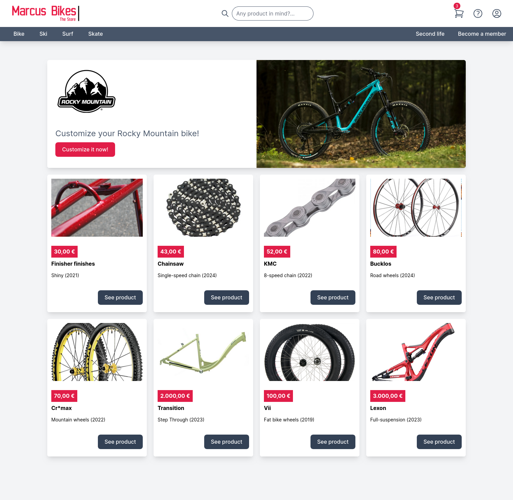

# Factorial's Backend Skills Test (by Moiśes Déniz Alemán)

Welcome to my implemention of the Marcus's Bikes Shop, the backend skills test for Factorial. 

## 📝 Instructions

### Setup

As this project is based on the [Ruby on Rails](https://rubyonrails.org/) framework, here you can find the steps in order have it working.

#### Prerequisites

You most probably have all the needed libraries set in your system if you have worked with Ruby on Rails lately. Here is a list of the base you need to have:

* [Ruby](https://www.ruby-lang.org) language is installed, 3.3.4
* [Ruby on Rails](https://rubyonrails.org/) framework CLI is installed, version 7.2.2
* [Bundler](https://bundler.io/) is installed, at least version 2.5
* [RubyGems](https://rubygems.org/) is installed, at least version 3.5
* You cloned the private repository and entered in a shell console inside it

Get all the gem dependencies needed by running bundler like this:

```bash
./bin/bundle install
```

To check that the app is working you can boot the webserver like this:

```bash
./bin/dev 
```
You should see an output similar to this:


And then browse to the listening url (by default is http://127.0.0.1:3000/). If you see something like this the app is successfully setup:



### Tests

The project uses [RSpec](https://rspec.info/) as testing framework. You can run the specs suite like this:

```bash
./bin/rails spec
```

Format for the output is set to [documentation](https://rspec.info/features/3-13/rspec-core/command-line/format-option/) by default in the project which prints more verbose sentences. 

## 🏗️ Solution Design

Given the specifications sent to me via email (see [PDF](doc/code_challenge_specifications.pdf)) we can extract the requisites for this project and make some assumptions in order to create the proper solution.

### Requisites

After carefuly reading the specifications provided I wrote down a list of requisites the app needs to fulfill:

1. The shop's catalog not only have bikes on it. Many other types of **products** can be sold. Eg: surfboards, skis, roller skates.
2. Products can be customized. Each product can have several **customizable parts**. Eg: a bike can have frame type, frame finish, wheels and wheels rim color as customizable parts.
3. User have to choose the final parts for their customization. For each customizable part the user needs to choose from the available **part options**.
4. Any part selected can avoid other parts to be selected too, no matter if they belong to different customizable parts. So, some **banned combinations** of parts exist.
5. Parts can be marked as "temporarily out of stock" to avoid receiving orders of products with those parts on it.
6. Price of products are either standalone or calculated based on their parts if they are customized.
7. The price of parts can be different if they are combined with other parts in a customization. So, the **price can be standalone or change** depending on other parts if they are selected.

### Questions about the requisites

With the specifications and the requisites more clear some questions may appear. Here is a list with their answers: 

1. Are parts also products we can sell in isolation in the shop? They could be, but we may not want to sell certain parts in isolation.
2. All the products must be customizable? No, certain products can be sold as they are provided.
3. All the customizable parts are the same for all the products? No, each product could have different customizable parts. Eg: "Customizable Bike" can have: frame type, frame finish, wheels, chain. Whereas "Ski set" can have: ski, bindings
4. Can a part's price depend on more than one part that are selected too? Yes, it may happen that a price changes for many other parts selected. Eg: frame color depends on frame type and frame finish. 

### Assumptions

Given the questions we can assume certain things that will shape even more our solution later:

1. A part is always a product. But we may not want to sell them in isolation, we need to mark them for direct sell somehow.
2. Not all the products have to be customizable. We need to mark the products as customizable somehow. In order to simplify this exercise, no customizable product can be a part option for another customizable product as this would require a hierarchy of customization that would make the UI much more complex.
3. Customizable parts can differ from one product to another. This means that the possible options for the parts have to be provided while setting up each product.
4. In order to permit multiple price changes we need to store those changes as increments for the standalone price. That way we can sum all the changes for the combinations of parts.

### Technical Solution

#### Language and Framework

The first choice I made was to select [Ruby](https://www.ruby-lang.org) language and leverage of the [Ruby on Rails](https://rubyonrails.org/) framework as I have more experience with.

#### Data model
##### Limitations
#### Main user actions
#### Product page
#### Add to cart action
#### Administrative workflows
##### New product creation
##### Adding a new part choice
##### Setting prices